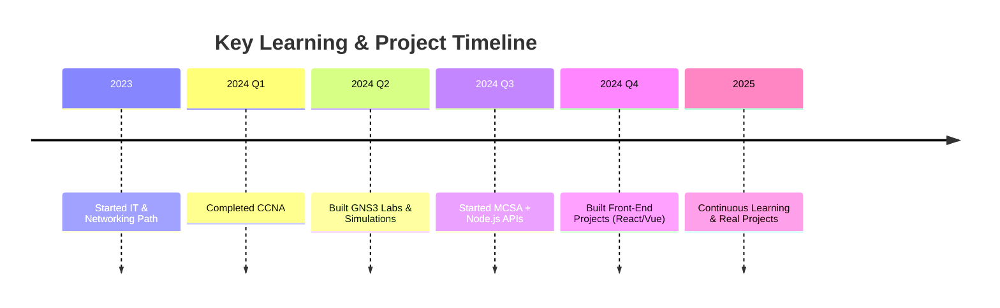

<!-- README.md for seka10 -->

<h1 align="center">
  Hey there! 👋 I'm Sayed Ayman
   
  
</h1>

  

---

## 👨‍💻 About Me

- 🎓 Specialized in **IT and Networking**
- 🧠 **CCNA Certified**, preparing for **MCSA**
- 💻 Working with **GNS3**, **Cisco Packet Tracer**, and network lab simulations
- 🎨 Front-End Developer using **HTML5**, **CSS3**, **Bootstrap**, **Tailwind CSS**, **JavaScript**, **React.js**, **Vue.js**
- 💬 Ask me about anything related to **Networking**, **APIs**, or **Linux basics**
- 📬 Email: **sayed.ayman900900@gmail.com**

---

## 🧠 Certifications

  
  

---

## 🚀 Tech Stack

  
   
  
  

---

## 📁 Featured Projects

### 📘 Book Store RESTful API
- 🧩 Technologies: Node.js, Express, MongoDB
- 🔗 [View on GitHub](https://github.com/seka10/Book-Store-Restful-API)

### 📝 To-Do List
- ⚙️ Tech: HTML, CSS, JavaScript (Vanilla)
- 🔗 [View on GitHub](https://github.com/seka10/todolist)

### 🧠 Memory Game
- 🎮 Fun game built with pure JS + DOM manipulation
- 🔗 [View on GitHub](https://github.com/seka10/Memory-Game)

---

## 🧾 Resume / CV

  

---

## 🌐 Connect with Me

  
  
  
  
  

---

## 📊 GitHub Stats & Activity

  
  

  

---

## 🗂️ Project Timeline

---

  

