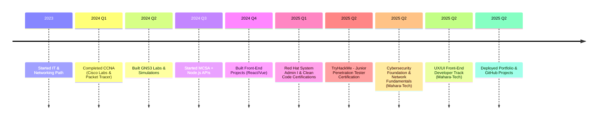

<!-- README.md for seka10 -->

<h1 align="center">
  Hey there! 👋 I'm Sayed Ayman
   
  
</h1>

  

---

## 👨‍💻 About Me

- 🎓 Specialized in **IT and Networking**
- 🧠 **CCNA Certified**, preparing for **MCSA**
- 💻 Working with **GNS3**, **Cisco Packet Tracer**, and network lab simulations
- 🎨 Front-End Developer using **HTML5**, **CSS3**, **Bootstrap**, **Tailwind CSS**, **JavaScript**, **React.js**, **Vue.js**
- 💬 Ask me about anything related to **Networking**, **APIs**, or **Linux basics**F
- 📬 Email: **sayed.ayman900900@gmail.com**

---

## 🛡️ Profiles & Certifications

  <!--Need some Changes -->
- 🧩 Practicing algorithms on HackerRank
- 🎓 Certified through Cisco Networking Academy
- 🛡️ Solving cybersecurity rooms on TryHackMe

  
  
  
 
  

---

## 🚀 Tech Stack

  
   
  
  

---

## 📁 Featured Projects

### 📘 Book Store RESTful API
- 🧩 Technologies: Node.js, Express, MongoDB

### 📝 To-Do List
- ⚙️ Tech: HTML, CSS, JavaScript (Vanilla)

### 🧠 Memory Game
- 🎮 Fun game built with pure JS + DOM manipulation

---

## 🌐 Connect with Me

  
  
  
  
  

---

---
## 📄 Certifications

| Certificate                                | Preview                                             | PDF Link     | Platform       |
|--------------------------------------------|-----------------------------------------------------|-------------------|----------------|
| **Protection system from Penetration testing**|  | [View PDF]( https://github.com/seka10/seka10/blob/main/certification/Course_Certificate_EDRAAK_Protect_Systems_From_penetrations.pdf ) | [ EDRAAK ]( https://www.edraak.org/ ) |
| **Certificate In Ethical Hacking** |  | [View PDF]( https://github.com/seka10/seka10/blob/main/certification/Course_Certificate_InEthicalHacking_En.pdf ) | [Mahara‑Tech](https://maharatech.gov.eg/) |
| **LinkidIN-Learning Certificate Of Completion Microsoft Cybersecurity Copilot** |  | [View PDF]( https://github.com/seka10/seka10/blob/main/certification/CertificateOfCompletion_Microsoft%20Security%20Copilot.pdf ) | [LinkedIN Learning]( https://www.linkedin.com/learning/ ) |
| **cyber Security attacks techniques**|  | [View PDF]( https://github.com/seka10/seka10/blob/main/certification/Edraak%20cyber%20Security%20attacks%20techniques.pdf ) | [ EDRAAK ]( https://www.edraak.org/ ) |
| **Network Security Introduction** |  | [View PDF](https://github.com/seka10/seka10/blob/main/certification/Network%20_Security_Introduction_Certificate-EN.pdf) | [Mahara‑Tech](https://maharatech.gov.eg/) |
| **LinkidIN-Learning Certificate Of Completion Cybersecurity Foundations** |  | [View PDF]( https://github.com/seka10/seka10/blob/main/certification/CertificateOfCompletion_Cybersecurity%20Foundations.pdf ) | [LinkedIN Learning]( https://www.linkedin.com/learning/ ) |
| **Implementation Computer Network Fundamentals** |  | [View PDF](https://github.com/seka10/seka10/blob/main/certification/Course_Implementation_Computer_Networking_Fundamentals_Certificate_En.pdf) | [Mahara‑Tech](https://maharatech.gov.eg/) |
| **Springs Cybersecurity + Microsoft** |  | [View PDF]( https://github.com/seka10/seka10/blob/main/certification/Microsoft%20-%20Certification.pdf ) | [Sprints]( https://sprints.ai/ar-eg ) |
| **Computer Network Fundamentals** |  | [View PDF](https://github.com/seka10/seka10/blob/main/certification/Course_Computer_Network_Fundamentals_Certificate_En.pdf) | [Mahara‑Tech](https://maharatech.gov.eg/) |
|**Introduction to Cyber Security**|  | [View PDF]( https://github.com/seka10/seka10/blob/main/certification/Course_Certificate_EDRAAK.pdf ) | [ EDRAAK ]( https://www.edraak.org/ ) |
| **HP Cyber Security** |  | [View PDF](https://github.com/seka10/seka10/blob/main/certification/HP_certificate.pdf) | [HP](https://www.life-global.org/) |
| **UI/UX (Front‑End Developer Track)**|  | [View PDF](https://github.com/seka10/seka10/blob/main/certification/Course_UX-UI_Certificate_En.pdf) | [Mahara‑Tech](https://maharatech.gov.eg/) |
| **Certificate Of Completion The Cybersecurity Threat Landscape**|  | [View PDF]( https://github.com/seka10/seka10/blob/main/certification/CertificateOfCompletion_The%20Cybersecurity%20Threat%20Landscape.pdf ) | [LinkedIN Learning]( https://www.linkedin.com/learning/ ) |
| **Cybersecurity Foundation** |  | [View PDF](https://github.com/seka10/seka10/blob/main/certification/Course_CyberSecurityforAll_Certificate_En.pdf) | [Mahara‑Tech](https://maharatech.gov.eg/) |
| **Cybersecurity Terminology Awareness** |  | [View PDF]( https://github.com/seka10/seka10/blob/main/certification/CertificateOfCompletion_Cybersecurity%20Awareness%20Cybersecurity%20Terminology.pdf ) | [LinkedIN Learning]( https://www.linkedin.com/learning/ ) |
| **Writing Clean Code / Clean Code Principles** |  | [View PDF](https://github.com/seka10/seka10/blob/main/certification/_Course_Clean_Code_Certificate_En.pdf) | [Mahara‑Tech](https://maharatech.gov.eg/) |
| **Junior Penetration Tester** *(TryHackMe)*|  | [View PDF](https://github.com/seka10/seka10/blob/main/certification/TryHackMe_Certification.pdf) | [TryHackMe](https://tryhackme.com/p/Seka10) |
| **Red Hat System Administration I**|  | [View PDF](https://github.com/seka10/seka10/blob/main/certification/redhat%20certifications%20-%20EN.pdf) | [Mahara‑Tech](https://maharatech.gov.eg/) |
| **Basics of cyber Security**|  | [View PDF]( https://github.com/seka10/seka10/blob/main/certification/Course_Certificate_EDRAAK_Basics_of_cyber_Security.pdf ) | [ EDRAAK ]( https://www.edraak.org/ ) |

## 📊 GitHub Stats & Activity

  
  

  

---
<h3 align="center">🏆 GitHub Trophies:</h3>
  

    
  

   

---

## 🗂️ Project Timeline

     <!-- Snake -->
  

---

  

---

